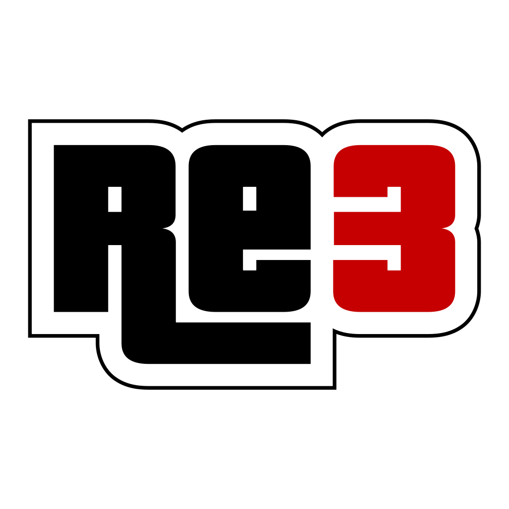

<p align="center">
  
</p>

<p align="center">
  <a href="III/README.md"></a>
  <a href="miami/README.md"></a>
  <a href="stories/README.md"></a>
</p>

# REGTA-3DSPort-Complete

REGTA brings three classic Grand Theft Auto games to New Nintendo 3DS:

- **Grand Theft Auto III**, based on re3 (`III`)
- **Grand Theft Auto: Vice City**, based on reVC (`miami`)
- **Grand Theft Auto: Liberty City Stories**, based on
  [reStories/reLCS](https://github.com/knackers4/res) (`stories`)

Trailer：https://youtu.be/fBzzLx0BX5M

Each game has its own source tree. They share the 3DS renderer, audio backend
and platform libraries, so fixes to those components benefit all three ports.

The original maps, missions and gameplay are kept intact. Most of the work here
goes into making them fit the 3DS: a lower-screen map and HUD, touch controls,
faster loading, lower memory use, and fixes for rendering and mission bugs.

> [!IMPORTANT]
> You need to build the ports yourself and supply your own game files: PC data
> for GTA III and Vice City, or extracted PS2 data for Liberty City Stories.
> Full game data, compiled builds and the devkitARM toolchain are not included.
> The repository provides the selected runtime overrides and finished HOME Menu
> artwork used by this port.

## The games today

All three ports have the lower-screen map and HUD, touch controls, Nintendo
button prompts and the text cheat keyboard. Each can be built as a 3DSX or CIA.
Their game-specific work is outlined below; the full [changelog](#changelog)
follows the setup instructions.

### GTA III

Built on re3 and the community 3DS port, with a dark-blue lower-screen HUD.
The focus has been smoother loading and streaming, clearer rendering and fixes
for problems encountered on hardware. Motion-blur trails are removed, vehicle
windows and decals render correctly, and the original static highlights are
kept at a lower strength. The tower-clock crash and the audio freeze that left
the radio playing have also been fixed.

Most of these changes have been tested on a physical New Nintendo 3DS. Large
pile-ups and busy scenes can still drop frames. The final mission supports
'push it to the limit', with an opening section and a repeating loop.

Uses **PC GTA III data**. [GTA III setup, controls and notes →](III/README.md)

### Vice City

Built on reVC, with Vice City's pink lower-screen HUD. Animation loading no
longer spends minutes on tiny reads, and the particle fixes restore smoke,
fire and other transparent effects. Character and vehicle diamond-shaped
polygons, washed-out car highlights and overlapping plates have been fixed.
Water keeps its near/middle/far detail levels, with smoother transitions.

Most changes have been tested on a physical New Nintendo 3DS, including a full
flight around the city. Demanding scenes can still cause frame drops or audio
stutter. The final mission supports 'Self Control', switching to the edited
climax after Lance's reveal.

Uses **PC Vice City data**. [Vice City setup, controls and notes →](miami/README.md)

### Liberty City Stories

Continues the unfinished
[reStories/reLCS project](https://github.com/knackers4/res), with a red
lower-screen HUD. Alongside the 3DS adaptation, this port fixes story
progression, saved world changes, cutscene characters, vehicle occupants,
water, glass effects and the final boat chase and helicopter battle. Vehicles
also have lightweight scene-colour reflections.

**The main story has been completed on a physical New Nintendo 3DS.**
Side missions and other optional activities have not yet been verified.
Please [open an Issue](#reporting-bugs) if you find a problem, with reproduction
steps, screenshots or video, and a crash dump if one was generated.

LCS also includes its own GTA-style text cheats, safehouse and mission
teleports, and 'Chase' for the final mission. Uses **converted PS2 LCS data**;
the asset-converter link is in the guide below.

[LCS setup, controls, cheat list and notes →](stories/README.md)

## Supported hardware

- New Nintendo 3DS
- New Nintendo 3DS XL
- New Nintendo 2DS XL
- A homebrew-capable system for 3DSX builds, or custom firmware for CIA builds

Old Nintendo 3DS, Old Nintendo 3DS XL and Nintendo 2DS systems are not
supported. These ports use the New 3DS's faster CPU, L2 cache and extra memory.

## Project layout

All three games and their shared dependencies live in this repository.
Download it once, then choose which game to build; there are no separate game
repositories or branches to assemble.

```text
REGTA-3DSPort-Complete/
├── common/       shared 3DS renderer, audio and platform dependencies
├── III/          GTA III / re3 game tree
├── miami/        Vice City / reVC game tree
├── stories/      Liberty City Stories / reLCS game tree
├── gamefiles/    selected runtime overrides for the three games
├── scripts/      setup, build, layout-check and 3DSX install helpers
├── packaging/    CIA scripts and finished CGFX banners, audio and icons
├── tools/        shared host-side utilities
└── docs/         historical implementation and verification notes
```

### The shared layer

`common` contains the platform components used by every game tree:

| Path | Purpose |
| --- | --- |
| `common/librw` | RenderWare replacement and the maintained Nintendo 3DS renderer |
| `common/libctru` | Pinned 3DS system library source |
| `common/citro3d` | Pinned Citro3D source |
| `common/openal-soft-ctr` | 3DS gameplay-audio backend |
| `common/mpg123-ctr` | MP3 decoder used by streamed-audio paths |

Each game's `vendor` directory links to the libraries in `common`. Keep those
symbolic links intact when cloning or copying the project. Mission logic, model
tables and game-specific rendering stay in `III`, `miami` and `stories`.

### The three game trees

| Source tree | Game | Original data source | SD data path | 3DSX filename |
| --- | --- | --- | --- | --- |
| `III` | Grand Theft Auto III | PC | `sdmc:/3ds/re3/` | `re3.3dsx` |
| `miami` | Grand Theft Auto: Vice City | PC | `sdmc:/3ds/miami/` | `revc.3dsx` |
| `stories` | Grand Theft Auto: Liberty City Stories | PS2 | `sdmc:/3ds/relcs/` | `relcs.3dsx` |

The folder names come from the original projects. Vice City still loads data
from `/3ds/miami`, so existing installations and saves continue to work even
though the executable is called `revc.3dsx`.
Older reLCS builds may have used `/3ds/restories`; move that `userfiles` folder
to `/3ds/relcs` before removing an old installation.

Keep the full directory layout even when building only one game. The shared
layout check expects all three source trees to be present.

## Quick start

Install the [build dependencies](#host-prerequisites) first.
Then, from the repository root:

```sh
./scripts/setup-game.sh relcs "/path/to/extracted/LCS/PS2/data" "/Volumes/SD/3ds"
./scripts/build.sh relcs
./scripts/install-3dsx.sh relcs "/Volumes/SD/3ds"
```

Replace `relcs` with `re3` or `revc` and provide the corresponding PC game
directory when preparing either PC title.

Installing the executable does not install the game data. Both CIA and 3DSX
builds load it from the matching folder under `sdmc:/3ds/`.

## Preparing game data

Run the interactive helper with no arguments:

```sh
./scripts/setup-game.sh
```

It asks for:

1. `re3`, `revc` or `relcs`;
2. the original game-data directory;
3. the mounted SD card's `/3ds` directory, not the SD root.

The same operation can be scripted:

```sh
./scripts/setup-game.sh re3   "/path/to/GTA III"       "/Volumes/SD/3ds"
./scripts/setup-game.sh revc  "/path/to/Vice City"     "/Volumes/SD/3ds"
./scripts/setup-game.sh relcs "/path/to/extracted LCS" "/Volumes/SD/3ds"
```

The helper copies the required data without changing the original files. It
leaves out desktop executables and temporary files, then copies selected
overrides from the root `gamefiles/<game>` folder. Existing saves in the
destination's `userfiles` folder are preserved.

The root [gamefiles folder](gamefiles/README.md) contains the selected overrides.
Only these files are published and applied by setup. The older `gamefiles`
folders inside each source tree remain ignored local references; setup no longer
reads them. Original model archives, radio stations and other base game data
still come from your own game.

### Expected SD data layout

This layout matches the files used for testing on a physical console:

```text
sdmc:/3ds/
├── re3/
│   ├── TEXT/  anim/  audio/music/  data/  models/  movies/  mp3/  txd/
│   ├── models/txd.img  models/txd.dir
│   ├── re3.ini
│   └── userfiles/
├── miami/
│   ├── Audio/music/  TEXT/  anim/  data/  models/  movies/  mp3/  txd/
│   ├── models/txd.img  models/txd.dir
│   ├── reVC.ini
│   └── userfiles/
└── relcs/
    ├── AUDIO/{CUTSCENE,MUSIC,NEWS}/  DATA/  TEXT/  anim/  models/
    ├── movies/  neo/  txd/
    ├── models/txd.img  models/txd.dir
    ├── reLCS.ini
    └── userfiles/
```

Keep the documented letter case even if the SD card itself is case-insensitive:
staging and verification may occur on a case-sensitive host. GTA III uses
`audio`, Vice City uses `Audio`, and LCS uses `AUDIO`; LCS data uses `DATA`.
The final-mission tracks therefore live at:

```text
re3/audio/music/PUSH_FM.WAV        re3/audio/music/PUSH_LOOP.WAV
miami/Audio/music/SELF_FM.WAV      miami/Audio/music/SELF_LOOP.WAV
relcs/AUDIO/MUSIC/CHASE_FM.WAV     relcs/AUDIO/MUSIC/CHASE_LOOP.WAV
```

The setup helper copies these included overrides:

| Game | Included data overrides |
| --- | --- |
| GTA III | `TEXT/american.gxt`, `audio/music`, `data/PARTICLE.CFG`, `data/main_d.scm`, `data/main_freeroam.scm`, `movies` |
| Vice City | `Audio/music`, `TEXT/american.gxt`, `data/particle.cfg`, `movies` |
| LCS | `AUDIO/MUSIC`, `movies`, `txd/LOADSC0.TXD` |

The remaining files come from your original game data or are generated by the
port. If you add an override, update both this list and the setup helper.

A clean install creates default `.ini` settings on first launch. Keep your own
settings and saves in `userfiles`; there is no need to copy someone else's.
Keep the generated `models/txd.img` and `models/txd.dir` texture cache too—it
makes a substantial difference to loading and streaming speed.

Desktop DLLs, old executables, logs and converter utilities left over from an
earlier installation are not needed on the SD card.

### Liberty City Stories data and audio

Prepare your PS2 assets with the
[reLCS Asset Converter from reStories](https://github.com/knackers4/res/releases/tag/relcs)
first. Its Windows executable is named `reLCSAssetConverter.exe`; see the
[upstream instructions](https://github.com/knackers4/res#how-can-i-try-it).
REGTA's setup helper expects converted assets, not just the contents of an
extracted ISO.

Select the prepared PS2 data folder containing:

```text
DATA/gta_lcs.DAT
models/gta3.img
AUDIO/sfx.RAW
AUDIO/MUSIC/*.VB
AUDIO/NEWS/*.VB
AUDIO/CUTSCENE/*.VB
```

The converter requires `ffmpeg` and a host C++ compiler. It converts the 19
continuous music/radio streams to 24 kHz mono IMA ADPCM WAV, avoiding the
real-time cost of MP3 radio decoding on 3DS. NEWS and CUTSCENE streams become
24 kHz mono MP3. The large source VB streams and redundant `SET0` through
`SET6` split banks are not copied; the active merged `sfx.RAW` and `sfx.sdt`
gameplay sound library is retained.

See [`stories/README.md`](stories/README.md) for the complete reLCS-specific
setup, controls, features and cheat-code reference.

## Building from source

### Host prerequisites

Production builds require devkitARM release 55 / GCC 10.2, which is not
distributed in this repository. Download and install that toolchain separately.
A newer system compiler can produce an executable that links cleanly but fails
on hardware because these ports use legacy libctru/newlib-era code.

Keep symbolic links intact when cloning or extracting the source. You will need:

- a POSIX shell, GNU Make, `rsync`, `md5sum` and normal Unix build tools;
- devkitPro host tools and 3DS port libraries, normally installed below
  `/opt/devkitpro/tools` and `/opt/devkitpro/portlibs`;
- a separately downloaded devkitARM release 55 / GCC 10.2 compiler tree;
- `ffmpeg` and a host C++ compiler only when preparing LCS audio from PS2 data.

On macOS, a normal devkitPro installation plus Command Line Tools and Homebrew
`coreutils` (for `md5sum`) supplies the host dependencies; install Homebrew
`ffmpeg` as well when preparing LCS. Point `DEVKITARM` at the separately
installed r55 compiler and `DEVKITPRO` at the directory containing the host
tools and port libraries. For example:

```sh
export DEVKITPRO=/opt/devkitpro
export DEVKITARM=/path/to/devkitARM-r55
export PATH="$DEVKITARM/bin:$DEVKITPRO/tools/bin:$PATH"
```

The build helper honors these variables and defaults to the conventional
`/opt/devkitpro` layout when they are not set.

### Verify and compile

Start from the repository root and verify the shared dependency links before
building:

```sh
./scripts/verify-layout.sh
```

Build one game or all three:

```sh
./scripts/build.sh re3
./scripts/build.sh revc
./scripts/build.sh relcs
./scripts/build.sh all
```

Expected outputs:

```text
III/build/re3.elf
III/build/re3.3dsx
miami/build/miami.elf
miami/build/miami.3dsx
stories/build/relcs.elf
stories/build/relcs.3dsx
```

Vice City builds as `miami.3dsx`; the install helper renames it to `revc.3dsx`.
The build helper sets the loading and lower-screen options used by the tested
builds, plus `OPTIMIZED_BUILD=1` for Vice City.

Do not reuse object files produced by another compiler or important flag set.
Clean only the affected tree and then rebuild it:

```sh
make -C III/build -f GNUmakefile clean       # GTA III
make -C miami/build -f GNUmakefile clean     # Vice City
make -C stories/build -f GNUmakefile clean   # LCS
```

Then rerun the matching `./scripts/build.sh` command. Test the result on your
console, especially after changing the compiler or build flags.

## Installing a 3DSX

Copy the build to your SD card with:

```sh
./scripts/install-3dsx.sh re3   "/Volumes/SD/3ds"
./scripts/install-3dsx.sh revc  "/Volumes/SD/3ds"
./scripts/install-3dsx.sh relcs "/Volumes/SD/3ds"
```

This produces `/3ds/re3.3dsx`, `/3ds/revc.3dsx` or `/3ds/relcs.3dsx`. The game
data remains in the directory shown in the architecture table above.

## CIA packaging

Once all three ELF files are built, you can package them as CIAs:

```sh
./packaging/production_cia/build_production.sh
```

The finished CGFX banners, encoded banner audio and 48×48 icons are included in
[packaging/prebuilt](packaging/prebuilt/README.md). Packaging uses them directly;
Blender, pycgfx, ImageMagick and the original vehicle assets are not needed.

Install zsh, bannertool, `makerom` and `3dsxtool` separately and put the
tools on `PATH`. You can also specify their executable paths with
`BANNERTOOL`, `MAKEROM` and `THREEDSXTOOL`. The generated banners,
icons and game packages are written only to the ignored output folder.

The completed packages are written to:

```text
packaging/production_cia/output/GTA3 For Nintendo 3DS.cia
packaging/production_cia/output/GTAVC For Nintendo 3DS.cia
packaging/production_cia/output/GTALCS For Nintendo 3DS.cia
```

| Game | Title ID | Product code | Long HOME title |
| --- | --- | --- | --- |
| GTA III | `00040000002F6000` | `CTR-P-0RE3` | Grand Theft Auto III |
| Vice City | `00040000002F6100` | `CTR-P-REVC` | Grand Theft Auto: Vice City |
| Liberty City Stories | `00040000002F6200` | `CTR-P-RLCS` | Grand Theft Auto: Liberty City Stories |

Production CIAs use New 3DS 804 MHz mode, L2 cache, expanded application
memory, direct SDMC access and the required video service. They contain no
commercial RomFS data and always load the original game files from the SD card.

### From source to console

For each game:

1. Preserve the repository's symbolic links and run `verify-layout.sh`.
2. Run `setup-game.sh` with your original
   game data and the SD card's `/3ds` directory.
3. Build the matching executable with `build.sh`.
4. Either copy the 3DSX with `install-3dsx.sh`, or build and install the CIA.
5. Keep or generate the native `txd.img`/`txd.dir` cache described below.
6. Launch the game on a New 3DS-family console and check that it loads correctly.

The tested installation uses original data, the included overrides, native
texture caches and a matching executable.

### Build and setup troubleshooting

- `verify-layout.sh` reporting a missing dependency normally means symbolic
  links were flattened or one game tree was moved away from `common`. Restore
  the repository layout before compiling.
- `md5sum: command not found` occurs while makefiles calculate their build
  fingerprint. Install GNU coreutils; substituting macOS `md5` does not match
  the options used by the makefiles.
- A compiler-version or stale-fingerprint failure requires the affected
  makefile's `clean` target followed by `build.sh`; do not delete another game
  tree or the shared libraries.
- LCS setup errors about `.VB`, `sfx.RAW` or `gta_lcs.DAT` mean the selected
  directory is not the expected extracted PS2 data root. Select the directory
  that directly contains `AUDIO`, `DATA` and `models`.
- If CIA packaging cannot find bannertool, `makerom` or `3dsxtool`, check
  that the tool is installed and its path is set.
- A package that reaches HOME Menu but cannot find data usually has the wrong
  runtime directory or letter case. CIA builds still require `/3ds/re3`,
  `/3ds/miami` or `/3ds/relcs` exactly as documented.
- A very slow first launch with no native texture cache can be normal. Do not
  interrupt cache generation merely because ELF and CIA construction were
  quick.

## Shared Nintendo 3DS interface

All three games use Nintendo button labels and the same basic controls:

- Circle Pad controls movement or steering.
- C-stick controls the camera.
- ABXY, L/R and ZL/ZR are mapped to the games' native actions.
- START pauses and SELECT cycles the gameplay camera.
- The lower screen presents loading progress, radar/status information and
  contextual touch controls.
- Touch the lower screen once to reveal the overlay. The first touch only
  reveals it; release, then tap L3/R3 or drag the Camera region.
- The overlay hides after five seconds without touch input.
- Press L + R + ZL + ZR together during gameplay to open the 3DS system
  keyboard for text cheat entry.

Some actions differ between games; follow the in-game tutorials and button
prompts for those.

## Changelog

Changes are grouped by game and system below. Shared fixes are listed once;
the game-specific sections cover the differences.

Most GTA III and Vice City changes have been tested on a physical New Nintendo
3DS. LCS has also been played from the beginning to the ending on hardware,
including all island unlocks, bridge and ferry changes, Fort Staunton's
destruction, saving and loading. LCS side missions and other optional activities
have not yet been verified. If you find a problem, please
[report it](#reporting-bugs) with the details needed to reproduce it.

### Shared New Nintendo 3DS platform

#### Build, runtime and distribution

- Brought re3, reVC and reLCS into one project, with separate game code and
  shared 3DS libraries linked through each game's `vendor` folder.
- Pinned every production build to devkitARM release 55 / GCC 10.2. The
  makefiles reject incompatible toolchains which can produce binaries that link
  successfully but crash on physical hardware.
- Added root-level setup, layout verification, build and 3DSX installation
  helpers. The setup route treats original data as read-only and preserves an
  existing `userfiles` directory.
- Limited setup to the overrides used by the tested installation. Old
  controller, generic-material and Neo samples in local folders can no longer
  overwrite the original PC vehicle textures during setup.
- Added reproducible 3DSX and CIA packaging for all three games, with separate
  title IDs, product codes and SD data directories.
- Configured the CIAs for New 3DS 804 MHz mode, L2 cache, expanded application
  memory, direct SDMC access and the video-decoder service.
- Kept commercial game data outside the executables and CIAs. Each game loads
  its legally supplied data from its own SD directory.
- Added optional hardware-decoded H.264 startup movies with mono PCM audio.
  Missing or unsupported movies are skipped; A, B, X or Y skips playback.

#### Lower screen and presentation

- Added a native 320×240 RenderWare camera for the lower screen in all three
  games.
- Replaced the small upper-screen radar with a large rectangular live map on
  the lower screen, including native rotation, zoom, roads, mission blips and
  edge-clamped distant markers.
- Kept the player at `(120,120)` so an 80-pixel status rail can occupy the right
  side without shifting the useful map area.
- Added a game-themed right-side HUD using each title's own font, weapon icons,
  health, armour, ammunition, time and money presentation.
- Removed duplicated persistent status elements from the upper screen while
  keeping wanted indicators visible when relevant.
- Added main-menu map artwork, loading stages, percentages and progress
  bars, with correct transitions between boot, menu, loading, gameplay, pause
  and cutscene states.
- Prevented one-frame streaming updates from flashing a loading screen and
  prevented cutscenes from exposing a stale lower-screen map or HUD.
- Added the touch overlay for L3, R3 and camera drag. The first touch reveals
  the overlay without activating anything, release arms it, and five seconds of
  inactivity hides it again.
- Pre-creates the touch textures before world loading so opening the overlay
  cannot force texture eviction or shrink other game textures.
- Corrected rotated-framebuffer assumptions, stale lower buffers, unsafe direct
  framebuffer writes and camera/raster lifecycle problems.

#### Nintendo controls and aiming

- Mapped prompts to Nintendo physical button labels instead of Xbox/PlayStation
  letter positions and replaced unsupported stick glyphs with readable
  `CIRCLE PAD`, `C-STICK`, `L3` and `R3` text.
- Added a radial dead zone of 0.14 for the Circle Pad and 0.18 for the C-stick,
  then rescaled the C-stick response for its shorter physical travel.
- Clears stale camera input during scene and vehicle transitions to prevent the
  view from continuing to drift.
- Made A confirm and B return in all three games. This includes GTA III's
  Ammu-Nation, Vice City's Ammu-Nation and hardware store, and every LCS shop.
  Shop scripts, menus and their button prompts now agree.
- Vice City and LCS pause maps use Y to place/remove a marker, ZR/R to zoom, L
  to toggle the legend and B to return; the displayed helper now matches the
  controls.
- Reversed the inherited sniper zoom mapping so A zooms in and B zooms out in
  all three games, including the dynamic prompt text.
- Changed every ordinary rifle to R third-person auto-aim. Holding L+R enters
  first-person rifle aiming; re3/reVC suppress the Standard-mode L fire alias
  until L is released so entering first person cannot waste a round. reLCS has
  no Standard-mode L fire alias and therefore needs no suppression.
- Replaced fragile texture-sampled Standard-mode sights with code-drawn geometry
  while retaining the original thin ring, centre dot, size and camera-derived
  position.
- Replaced the filtered rocket-launcher sight with solid corner geometry so its
  thin lines remain complete at 3DS resolution.
- Added a one-physical-pixel red centre cross to the laser scope in Vice City
  and LCS. The ordinary bolt-action sniper scope is unchanged.
- Thickened GTA III's lock-on square without changing its dimensions or colour;
  Vice City retains its original thicker double-ring design.
- Added a gameplay-only L+R+ZL+ZR shortcut to the 3DS software keyboard. Text is
  fed into each game's original cheat parser rather than a separate cheat
  implementation.
- Rewrote affected tutorial, contextual, map and save prompts to describe the
  actual 3DS controls instead of unavailable controller buttons.

#### RenderWare and GPU correctness

- Repaired 3DS skinning, MatFX, texture, alpha test, immediate-mode drawing and
  raster-state caching shared by the three games.
- Fixed alpha-test enable caching which could leave transparent foliage texels
  writing depth and hiding scenery behind leaves or fences.
- Reapplies texture alpha state even when the raster binding hits the GPU cache,
  preventing intermittent opaque rectangles and black transparent surfaces.
- Clears cached raster bindings before native textures are destroyed and avoids
  sampling cleared loading/camera rasters.
- Fixed point, line and polyline primitive conversion so vertices are indexed
  once, with bounds checks around immediate-mode data.
- Added a bounded per-frame VBO/IBO path for large indexed immediate-mode
  batches. Buffers are allocated lazily with a linear-memory safety margin and
  fall back to the old immediate path if memory is tight.
- Corrected buffered colour attributes to normalized floating point, avoiding
  the white saturation produced by feeding byte colours to PICA200.
- Added bounded per-frame skin buffers so several protected or high-detail
  characters cannot overwrite one shared transformed-vertex buffer.
- Uses stable texture/material colour paths for affected skinned characters and
  MatFX vehicles, removing black, white and diamond-shaped polygon corruption.
- Reworked vehicle MatFX so the authored coefficient remains visible without
  turning entire panels white. GTA III and Vice City use their inexpensive
  static environment textures; LCS uses the separately bounded capture path
  described in its game-specific section.
- Preserves alpha windows, lamps and damage layers instead of routing them
  through an opaque reflection pass.
- Added depth offsets for separate decals, badges, stripes, liveries and
  plates, matched by texture and mask name. These offsets do not affect shared
  body textures, where they could pull the whole body apart.
- Added LRU texture reclamation and a streaming-pressure callback. Whole unused
  streamed assets are released before destructive mip removal is considered.
- Protects player and vehicle top mip levels in the games that need it, allowing
  detail to return normally after streaming pressure.

#### Streaming, memory and audio

- Added native 3DS CD-image streaming and bounded asynchronous read handling.
- Preloads standalone animation archives through memory streams where thousands
  of tiny SD reads would otherwise dominate startup time.
- Limits completed streaming conversion work per frame so walking or driving
  into a new area cannot monopolise the main thread.
- Added staged, throttled loading updates and multi-channel read/convert overlap
  where it provides a measured benefit.
- Added graceful low-linear-memory fallbacks for textures, skinning and buffered
  immediate-mode geometry.
- Removed redundant stereo decoding, copying and synchronisation from the
  ports' mono audio output.
- Sets audio channel limits separately for each game. re3/reVC use all 28
  backend channels, including the reserved channel; LCS keeps its lighter
  handheld mix and drops
  PC/PS2-only reflection, reverb and surplus-channel work.
- Protects mission dialogue, cutscene speech, UI, player actions, weapons,
  explosions and emergency sounds from low-priority ambience replacement.
- Keeps one-shot sounds attached to their original source, suppresses
  duplicate requests and bounds repeated collision reports from pile-ups.
- Handles streamed-audio format notifications without reopening a valid stream,
  uses short startup queues and performs at most one bounded refill per frame.
- Disabled unused 3DS audio-reflection probes and other disproportionately
  expensive secondary effects.
- Applies bounded budgets to particles, collision debris/audio, distant vehicle
  occupants, point lights, fire emissions, explosion side effects, muzzle
  flashes, smoke, shells and bullet traces while preserving gameplay hits,
  physics, traffic, wanted dispatch, fire and explosions.
- Expanded the displayed save-title path in all three games without changing
  the fixed 48-byte save header or shifting the following save blocks. Long
  titles store their GXT key in the compatible field and resolve to the complete
  localized mission name; known ellipsis-truncated saves from older builds are
  recovered as well.
- Added an independent mono streamed-music source for each final mission. It
  keeps native dialogue and sound effects free, switches from an opening `FM`
  file to a gapless looping file, locks radio selection for the mission and
  stops on failure, restart or completion.

### Grand Theft Auto III / re3

- Completed the full lower-screen map, dark-blue status rail, loading display,
  main-menu Liberty City map, touch controls and upper/lower HUD split.
- Embedded the main-menu map so it does not depend on an optional SD
  `menu.txd`, and corrected its crop, scale and detached edge fragment.
- Added a readable opening tutorial explaining that navigation and mission blips
  are shown on the lower screen.
- Preserved the fast `USE_TXD_CDIMAGE` native texture-cache route that is
  essential to smooth streaming on hardware.
- Preloads standalone animation data and throttles main-thread streaming
  conversion to reduce long walking/driving stalls.
- Enforces mono-only audio builds and removed the dual-queue wait which could
  freeze gameplay while a vehicle radio continued looping.
- Removed the persistent temporal/dynamic motion-blur trail on 3DS for a clearer
  picture and lower rendering cost; colour overlays and special camera effects
  still render through their non-history path.
- Uses a 0.65 high-detail LOD scale on 3DS while retaining authored draw ranges
  and the original desktop value outside the 3DS build.
- Fixed GTA III's white vehicle diamonds and overbright reflections. The
  original static white MatFX highlight is retained at half strength, while
  timecycle colour is kept out of the reflection so blue paint cannot become
  orange at sunset.
- Fixed transparent vehicle windows, lamps and independently modelled service
  vehicle decals, including taxi, ambulance, coach, police/LCPD, fire,
  Mr Whoopee, Mr Wongs, Mule, Panlantic, Securicar, Toyz and Yankee overlays.
- Fixed the Staunton commercial-district tower-clock crash caused by
  double-indexed immediate-mode line vertices.
- Caps active 3DS particles at 256 while retaining the original logical pool and
  particle types; secondary pile-up, fire, light, explosion and occupant work is
  budgeted separately.
- Limits registered point lights to 12, renders traffic occupants only inside
  28 metres while always preserving the player vehicle's occupants, and spaces
  persistent fire emissions at 120 ms instead of 80 ms. These cuts target work
  that is hard to see at a distance or becomes expensive in large pile-ups.
- Uses the shared R third-person / L+R first-person rifle controls for the AK-47
  and M16, with Standard-mode empty-shot suppression.
- Uses A to buy and B to leave Ammu-Nation, B for every frontend return, Y for
  the enhanced map marker where available, and A/B for sniper zoom in/out.
- Adds `'push it to the limit'` to the final mission: it begins at the first
  playable prompt after Claude strikes the guard, automatically hands off from
  `PUSH_FM.WAV` to the gapless loop, shows the song name in the GTA III radio
  heading style while driving, and fades promptly when Catalina's helicopter
  is destroyed. Gameplay volume is 80%, with scripted scenes at 40%.
- Added a custom icon and an animated HOME Menu Kuruma banner, included as
  finished packaging inputs.

### Grand Theft Auto: Vice City / reVC

- Completed the full lower-screen map/HUD/loading/touch presentation in Vice
  City's pink theme, with rectangular edge markers and correctly positioned
  upper-screen wanted stars.
- Reads `PED.IFP` once and parses it from memory, eliminating the former
  multi-minute sequence of tiny animation reads.
- Added an 8192-slot hashed model-name lookup for collision loading and retains a
  safe linear fallback for late registrations.
- Added a two-channel loading pipeline, staged progress and
  throttled lower-screen updates.
- Restored all 41 fields in Vice City's `particle.cfg`. Entries are now matched
  by particle name instead of line number.
- Combines separate colour and alpha-mask particle textures on 3DS, restoring
  smoke, fire, rain, dust, debris, blood, shells, heat haze, water effects and
  other particles that previously appeared as opaque rectangles.
- Caps active particles at 256 and bounds automatic-weapon visuals without
  changing weapon damage or hit detection: at most four 300 ms bullet traces
  remain active, each trace uses one centre submission instead of three, and a
  frame accepts up to three muzzle flashes, two gun-smoke particles and two
  shells.
- Fixed black/diamond-shaped polygons on skinned people and protected important
  mission characters from transformed-buffer collisions.
- Fixed black and white diamonds, blown-out panels, wrong body colours,
  transparent-material failures and reflection errors on cars, motorcycles,
  tanks, boats and aircraft.
- Fixed decals and plates on police, service, delivery and racing vehicles;
  includes a narrowly matched geometry correction for the unusually close
  Admiral rear-plate surface.
- Fixed player and vehicle textures becoming permanently degraded after memory
  pressure.
- Fixed boat/water corruption by restoring the correct render order and water
  depth interaction.
- Fixed ocean and pool sectors appearing in obvious chunks by submitting the
  large flat-water batches through the buffered 3DS geometry path.
- Preserved Vice City's near/middle/far water optimisation but replaced the hard
  three-band boundary with a 96-unit per-vertex alpha transition. Near dynamic
  water uses the same stable material-colour path, removing the white foreground
  band.
- Fixed crashes during helicopter and aircraft flights through areas with heavy
  streaming. A full circuit around Vice City has been tested on hardware.
- Prepares mission and telephone dialogue outside the critical start frame and
  supports complete mono PCM dialogue buffers on dedicated NDSP channels.
- Restored default pedestrian and traffic multipliers from the temporary 0.6
  test value to 1.0.
- Fixed startup on established installations by keeping `/3ds/miami` as the
  primary data directory, accepting `/3ds/revc` as a fallback, and avoiding
  pre-RenderWare C++ teardown if neither directory exists.
- Prevents the cleared grey loading rectangle from retaining a stale splash
  texture by invalidating the 3DS raster binding when loading/camera rasters are
  cleared or destroyed.
- Retains Vice City's original static white MatFX vehicle highlight at the same
  restrained half strength as GTA III. It adds gloss without a dynamic capture,
  overexposing dark paint or inheriting the sunset tint.
- Uses R third-person / L+R first-person aiming for the M4, Ruger and M60, and
  adds the red centre cross to the laser scope.
- Uses A to buy and B to leave Ammu-Nation and the hardware store. The pause
  map uses Y for marker, ZR/R for zoom, L for legend and B for back, with
  matching help text.
- Adds `'Self Control'` to `Keep Your Friends Close...`: the opening file starts
  with gameplay and hands off to a gapless loop. Lance's `FIN_3` reveal fades
  the current section; the first `FIN_B1` gameplay prompt then starts the edited
  climax exactly once even if that prompt is refreshed. The ending cutscene
  fades and stops it. Radio switching is locked, the title is shown briefly at
  mission start, gameplay volume is 80%, and scripted scenes use 40%.
- Added a custom icon and an animated HOME Menu Admiral banner, included as
  finished packaging inputs.

### Grand Theft Auto: Liberty City Stories / reLCS

#### Core port, data and saves

- Completed and fixed the reStories/reLCS code so Liberty City Stories can be
  played from beginning to end on New Nintendo 3DS, using the PS2 game's models,
  textures, maps, scripts and audio.
- Added `TELEPORTH` and `TELEPORTM` text cheats. They stream the destination
  first, verify an outdoor road landing, then place Toni or his current vehicle
  away from the safehouse or main-story mission trigger; side activities are
  excluded.
- Added memorable LCS-specific aliases for the working keyboard cheats while
  retaining their short diagnostic names. `TANKYOULIBERTY` remains the Rhino
  phrase; `TELEPORTH`, `TELEPORTM` and the final-mission `SKIP` checkpoint helper
  keep their original debug names.
- Corrected mission-block loading, block-relative branch targets, script
  function returns, missing compatibility opcodes and startup-cutscene ownership
  so ambient mission triggers cannot run over the introduction.
- Added the PS2 LCS vehicle, bike, boat, ferry, pedestrian, weapon, script,
  garage and world systems needed for the campaign.
- Added a reproducible PS2 audio-preparation route: continuous MUSIC streams are
  converted to 24 kHz mono IMA ADPCM WAV, NEWS/CUTSCENE streams to 24 kHz mono
  MP3, while the merged gameplay `sfx.RAW`/`sfx.sdt` library is retained.
- Uses `/3ds/relcs` for runtime data and saves, with LCS-specific HOME title,
  product code, loading image and game-data overlay.
- Replaced PS2 memory-card and console-removal save wording with SD-card and
  system-appropriate text, and restored the missing warning shown after cheats
  have been activated.
- Uses LCS's first valid mission title as the fallback save name, preventing an
  inherited Vice City key from appearing when an old or damaged statistics
  block contains no last-mission name.
- Added native ARM save blocks for the complete player, ped, vehicle, object,
  path, script, streaming and world state required by LCS.
- Restored the script timer on save/load, rejects incompatible early experimental
  save layouts cleanly, and provides offline conversion for older formats.
- Preserves hidden-package rewards, safehouse pickups/objects, garage vehicles,
  mission-heavy vehicle flags, special vehicles and the complete resident-model
  state.
- Corrected restart/load ordering so markers, player pools, scripts, streaming
  and audio cannot observe half-destroyed or half-restored state.
- Avoids the high-intensity final-exit crash by skipping redundant RenderWare
  geometry teardown only when the 3DS process is already terminating; in-game
  restart and normal cleanup remain intact.

#### Missions, progression and world state

- Restores saved building model swaps and invisibility records using pool-safe
  handles instead of stale raw entity pointers.
- Restores the Callahan Bridge construction/ramp phase, both visible ramp halves,
  road collision and mission-removed barriers after loading native or converted
  saves.
- Restores lift-bridge state, ferry routes, Fort Staunton intact/destroyed phase,
  matching collision stores and removed mission blockers after loading.
- Reapplies bridge and ferry progression flags when loading without restarting
  the game. Loading a later save and then an earlier one no longer leaves the
  wrong bridges, barriers or ferry state behind.
- Fixes the Fort Staunton intact/ruined IPL mixture which caused overlapping
  geometry, Z-fighting and unnecessary draw cost.
- Adds safe locate handling for temporary mission actors which have not yet been
  recreated during a loaded mission frame.
- Fixes `Friggin' the Riggin'`: flamethrower contact now applies normal object
  damage to the leaflets and printing presses, so the weapon supplied at mission
  start can complete the objectives.
- Restores the visible magnet model on Portland's vehicle crusher and top cranes,
  including saves made before the hook pointer existed; crane behaviour itself
  was already functional.
- Clears leftover script-controlled vehicle braking and radio state after a
  successful mission.
- Repairs `The Sicilian Gambit` staging: both scripted boats and their occupants
  are retained, the departing boat no longer leaves an orphaned component, and
  the Salvatore chase boat is identified by its real occupant instead of a
  camera position. That boat is protected only during the lighthouse
  cleanup transition, avoiding the premature explosion and false mission
  failure while enemy boats remain damageable.
- Restores the lighthouse helicopter battle by assigning the attached gunners a
  real combat objective and preserving mission rockets. Massimo performs the
  complete door/open/boarding animation; a narrow temporary collision exemption
  prevents the vertically moving helicopter from knocking him down without an
  early teleport into the seat.
- Restores the complete `CRED01` ending-credit table and its section layout.
- Adds `'Chase'` to the final mission. It starts at the first playable prompt or
  the native hospital-taxi boat checkpoint, hands `CHASE_FM.WAV` to a gapless
  loop, displays the title in LCS's radio style while driving and locks radio
  switching. The Massimo confrontation line fades the current section to
  silence, the first post-cutscene helicopter objective starts the edited
  climax once, and the helicopter crash fades the track out. Widescreen scenes
  duck to 50% without pausing the stream.

#### Player, cutscenes and HUD

- Fixed native 3DS saves with mission vehicles crashing during load. The
  vehicle type is now read at the same one-byte width used by the writer,
  preserving the following model, pool slot and vehicle state fields; existing
  affected LCS7 saves remain loadable without conversion.
- Fixed Toni and other pedestrians repeating the landing/collapse animation
  indefinitely while preserving the intended one-shot hard-landing roll. The
  airborne fall pose now uses Vice City's partial repeating association and
  fades cleanly into the non-repeating collapse animation.
- Fixed the high-detail speaking CG characters whose face, limbs and body
  polygons jumped or broke apart. The importer attaches HAnim hierarchy frames,
  matches tagless animation sequences to actual DFF node names and reserves four
  LCS-only 64 KiB skin buffers for models with more than 24 bones.
- Corrected compressed-animation allocation sizes and hierarchy-length timing,
  preventing large cutscene animation loads from exhausting memory or writing
  through a failed allocation.
- Removed an unused full pedestrian-shadow fallback from high-detail cutscenes,
  reducing unnecessary work for each character.
- Corrected the cutscene hidden-entity restoration loop so unrelated people do
  not disappear and the loop cannot walk outside its saved list.
- Fixed the post-cutscene “Toni standing through the vehicle” state. Vehicle
  occupant ownership, ped state, position and the correct car/bike/boat seat
  animation are rebuilt after the script pass and validated during player
  updates.
- Exempts arrest and exit transitions from that repair, fixing the separate
  in-vehicle arrest freeze where `BUSTED` appeared only after trying to exit.
- Skips the optional 2.3 MiB full-controller diagram on 3DS while retaining the
  small button glyphs and control text. This prevents fragmented-memory stalls
  or out-of-memory failure when opening the pause controls page.
- Prevents ZL/ZR drive-by look controls from cycling away from the only weapon a
  vehicle can fire; the current drive-by SMG remains selected through cutscenes.
- Restores race countdown updates so 3-2-1 advances instead of remaining on 3.
- Disabled the race checkpoint light columns, which stayed at old checkpoints
  instead of moving with the race. The working arrows are kept.
- Makes mission titles remain fully visible for at least 3 seconds, preserves
  any script-authored longer hold, and then uses the normal fade. Text and scene
  fade together, including letterboxed cutscenes.
- Restores the fade/lifetime of mission-passed and other queued big messages
  without freezing live countdown replacements.
- Corrects the odd-job reward colour to the intended LCS mission-title gold.

#### Rendering, streaming, water and vehicles

- Uses distance to a large building's surface when deciding whether to load,
  fade or unload it. This reduces nearby buildings flickering between high
  detail, half transparency and their low-detail model.
- Keeps authored complete-island LOD models visible from other islands instead
  of culling them only because their origin is far from the camera. This still
  needs more testing at distant viewpoints.
- Restores streamed safehouse and mission interiors from LCS's full model table
  without imposing Vice City's stricter area tags.
- Fixes foliage cut-outs so transparent leaves do not hide background geometry,
  and uses a cheaper one-pass alpha path while keeping LCS's required vegetation
  distance.
- Fixes pools and ocean tiles loading only at very short range or appearing one
  square at a time by using the buffered flat-water submission path.
- Fixes near ocean water turning white by matching the dynamic layer's material
  colour and normalized vertex-colour path to the far sectors.
- Fixes ferry body colour changes and black triangle/diamond corruption by
  bypassing the unstable environment texture while retaining a lightweight
  material-colour reflection.
- Adds LCS-style scene-colour reflection to vehicles without applying a full
  extra world render. The player vehicle captures an ultra-low-resolution strip
  after the static world and before vehicles once every three frames; bright
  road markings, signs, sky and nearby colour features are stretched into a
  restrained overlay while broad ground colour and rainbow saturation are
  filtered out. Nearby traffic receives one frozen capture, vehicles beyond
  35 metres stay on the base path, and entry/exit crossfades hide the former
  plastic-grey colour jump.
- Fixes completely black unbroken windows on Rumpo and other affected LCS
  vehicles by matching their window nodes and materials; black trim and
  bumpers are excluded.
- Restores LCS vehicle wheels, lights, body colour, decals, plates, damage layers
  and reverse audio through the maintained 3DS vehicle path.
- Adds precise depth treatment for LCS decals and plates in both ordinary and
  MatFX render paths without biasing complete body atlases.
- Embeds the inherited `wincrack_32` texture and retains a nil-safe fallback,
  fixing the crash when bullets or vehicles shatter world glass while preserving
  the series' triangular glass-shard effect.
- Caps active particles at 256 and halves only excessive persistent wheel
  dirt/sand/smoke creation, with a six-per-frame burst ceiling; mission and impact
  effects remain available.
- Sets new-install density defaults to match the other ports: 25 exterior
  pedestrians, up to 40 in supported interiors, 12 active traffic vehicles and
  1.0 pedestrian/traffic multipliers. An existing `reLCS.ini` can retain a
  different personal density setting. Streaming can retain 25 vehicle models
  while staying inside a 50 MiB streaming-memory ceiling.
- Uses the shared 0.65 high-detail LOD scale while retaining special authored
  handling for vegetation, large buildings and island LODs.
- Uses R third-person / L+R first-person rifle aiming, laser-scope centre cross,
  A/B scope zoom, A shop confirm/purchase, B shop/menu back, Y map marker,
  ZR/R map zoom and L legend.

### HOME Menu icons and banners

- Added separate custom SMDH icons and animated vehicle banners: Kuruma for GTA
  III, Admiral for Vice City and Leone Sentinel for LCS.
- Uses each game's vehicle models, materials and wheels, with animation and
  banner audio.
- Added antialiased alpha-blended title artwork suitable for the 3DS HOME Menu's
  low resolution.
- Reduced the LCS logo from 256×256 to 128×128 and removed its unnecessary
  dedicated vehicle-grime texture reference, bringing the banner below the HOME
  resource limits and fixing the HOME Menu freeze.
- Corrected the LCS logo's `g` edge after bilinear filtering and added subtle,
  correctly positioned door-handle highlights to the Leone Sentinel.
- Reuses the finished LCS banner unchanged when packaging gameplay updates.
- Keeps the existing banners and SMDH files reusable for code-only packages;
  rebuilding game code does not require Blender or another visual export.

## Texture caches and first launch

`models/txd.img` and `models/txd.dir` are generated native texture caches, not
original source assets. When they are absent, a build with `USE_TXD_CDIMAGE`
can create them from the installed game data. First-time conversion on the
console may take a long time. Preserve a known-good generated cache unless the
underlying textures or converter change.

The capability record (`DATA/CAPS.DAT` in LCS) is generated with the cache.
A fresh setup will not contain that record, the texture cache or personal
settings until the game creates them.

Use caches made by the matching converter, with mipmaps intact. An old or
incorrectly converted cache can still cause texture problems or slow streaming
even if its filenames are correct.

## Save data

Each game stores settings and saves under its own runtime directory:

```text
sdmc:/3ds/re3/userfiles/
sdmc:/3ds/miami/userfiles/
sdmc:/3ds/relcs/userfiles/
```

Back up `userfiles` before replacing save-conversion tools, testing modified
scripts, or migrating from an older runtime path. The setup helper preserves
an existing destination save directory, but a manual folder replacement may
not.

## Known limitations

- New 3DS-family hardware is required.
- Initial native texture conversion can be slow.
- Very busy scenes and demanding cutscenes can still cause frame drops or
  audio stutter.
- Emulator performance and behaviour can differ from a physical console.
- ASI plugins, CLEO scripts, binary desktop patches and desktop limit adjusters
  do not work. Their functionality must be integrated into source and rebuilt.
- reLCS required more reconstruction than re3 or reVC. The main story is
  playable to the end, but not every unused PSP/PS2 feature has been recreated.
- LCS main-story completion has been verified on a physical New Nintendo 3DS.
  Side missions and other optional activities have not yet been verified.

## Reporting bugs

If you run into a problem, please open an Issue in this repository. Include
as much of the following as you can:

- The game, build or commit, console model, and whether you use CIA or 3DSX.
- The mission name or location, steps to reproduce the problem, what you
  expected to happen, and what actually happened.
- Whether it happens every time, only after extended play, or after loading
  a save; mention any cheats or mods used.
- The crash dump (`crash_dump_*.dmp`) if one was generated, plus any relevant
  logs.
- Screenshots or a short video showing the problem. A save from just before
  the issue is helpful too.

You can still report a bug without a dump—for freezes, missing objects and
mission problems, clear reproduction steps and pictures are often more useful.

## Credits and legal notice

The LCS port is based on
[reStories by knackers4 and its contributors](https://github.com/knackers4/res).
We continued its unfinished reLCS implementation and adapted it for New 3DS.
The [PS2 asset converter](https://github.com/knackers4/res/releases/tag/relcs)
also comes from that project.

This project also builds on re3/reVC, the original community Nintendo 3DS port,
librw, devkitPro, libctru, Citro3D, OpenAL Soft, mpg123 and their contributors.

The source is provided for educational, documentation and modding purposes.
This project is not affiliated with Rockstar Games or Take-Two Interactive.
The full original games are not included. The selected overrides and HOME Menu
artwork do not replace the required game data. Please keep the upstream credits
and follow the licences of the code you use.
