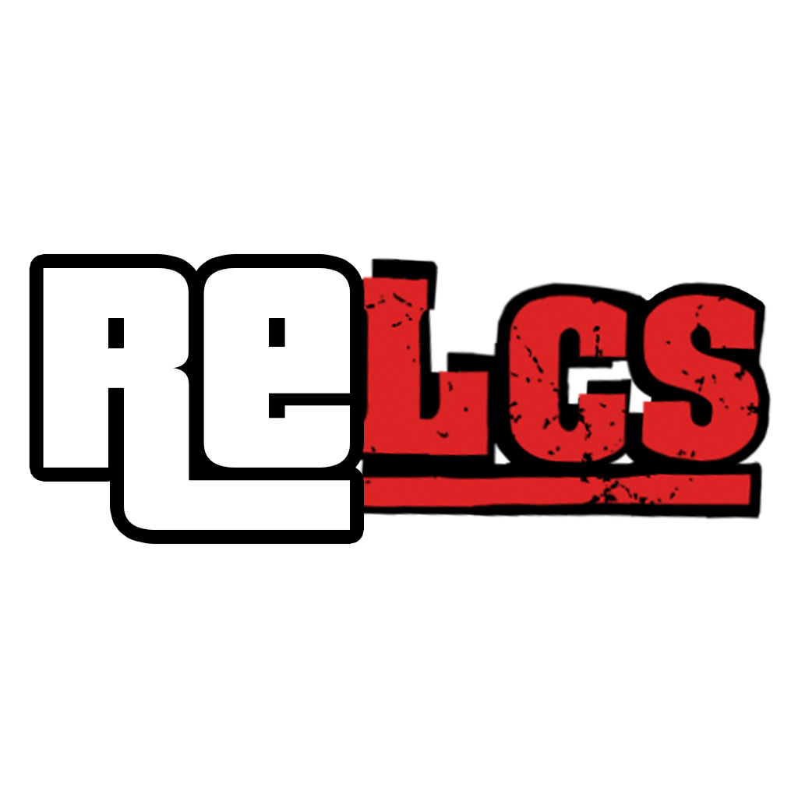

# reLCS for New Nintendo 3DS

This is REGTA's Liberty City Stories port, based on
[reStories by knackers4 and its contributors](https://github.com/knackers4/res).
REGTA builds on that unfinished reLCS implementation, adding the 3DS renderer,
audio and controls, and fixing the remaining problems needed to complete the
story. The main story has been played from beginning to end on a physical
New Nintendo 3DS. Side missions and other optional activities have not yet
been verified.

The port uses data extracted from the **PlayStation 2 version of Grand Theft
Auto: Liberty City Stories**. The full game data is not included; selected
runtime overrides and finished HOME Menu artwork are provided.

> [!IMPORTANT]
> You must own the game and provide your own extracted PS2 data. This project
> is not affiliated with Rockstar Games or Take-Two Interactive.

## About this port

The work here covers story progression, island and bridge changes, saves,
vehicles, audio and the dual-screen interface. It also fixes mission bugs that
prevented completion, including the final boat chase and helicopter battle.
Some unused PSP/PS2 features and debug functions are still incomplete.

The main [changelog](../README.md#changelog) lists the shared changes and
[LCS fixes](../README.md#grand-theft-auto-liberty-city-stories--relcs).
This page covers LCS setup, controls and cheats.

## Supported hardware

- New Nintendo 3DS
- New Nintendo 3DS XL
- New Nintendo 2DS XL
- Homebrew Launcher for `relcs.3dsx`, or custom firmware for the CIA package

Old 3DS-family systems are not supported. The game is built for the additional
CPU speed and memory available on New 3DS hardware.

## Runtime layout

The executable and original game data are installed separately:

```text
sdmc:/3ds/relcs.3dsx          Homebrew Launcher executable
sdmc:/3ds/relcs/              extracted and prepared LCS data
sdmc:/3ds/relcs/userfiles/    settings and save files
```

The CIA uses the same `sdmc:/3ds/relcs/` data directory. Installing a CIA does
not install the original models, map, scripts or audio.

Older development builds used `sdmc:/3ds/restories/`. Move its `userfiles`
folder into `sdmc:/3ds/relcs/` before retiring the old directory.

## Preparing PS2 game data

Start with your own PS2 copy and the upstream
[reLCS Asset Converter](https://github.com/knackers4/res/releases/tag/relcs).
The reStories release provides it as `reLCSAssetConverter.exe`, a Windows
tool for converting the PS2 assets into the layout reLCS expects. Follow the
[upstream instructions](https://github.com/knackers4/res#how-can-i-try-it)
for that step; simply extracting the ISO is not the same as converting its
assets.

The asset converter comes from reStories, not REGTA. Our setup helper takes
the prepared data folder and handles the additional 3DS installation and audio
conversion steps below.

Use the repository-level setup helper from the root of
REGTA-3DSPort-Complete:

```sh
./scripts/setup-game.sh relcs "/path/to/extracted/LCS" "/Volumes/SD/3ds"
```

With no arguments, `setup-game.sh` also provides an interactive prompt.
The final argument must be the mounted card's `/3ds` directory, not the volume
root.

The prepared PS2 data directory must contain at least:

```text
DATA/gta_lcs.DAT
models/gta3.img
AUDIO/sfx.RAW
AUDIO/MUSIC/*.VB
AUDIO/NEWS/*.VB
AUDIO/CUTSCENE/*.VB
```

The setup helper checks and copies your PS2 data, then applies selected files
from the included `gamefiles/relcs` folder at the repository root:
`AUDIO/MUSIC`, `movies` and `txd/LOADSC0.TXD`.
See the [data guide](../README.md#preparing-game-data) for details.
Your original files and existing destination saves are preserved.

### Audio conversion

PS2 stream files are not copied directly to the SD card. The setup helper builds
the included VB decoder and uses `ffmpeg` to create formats chosen for New 3DS:

- MUSIC: 24 kHz mono IMA ADPCM WAV;
- NEWS: 24 kHz mono MP3;
- CUTSCENE: 24 kHz mono MP3;
- gameplay effects and speech: merged `sfx.RAW` plus `sfx.sdt`.

IMA ADPCM is used for continuous music and radio because decoding MP3 while
driving creates avoidable CPU pressure. The original MUSIC MP3 or VB files are
not required after a successful conversion. The redundant PS2 `SET0` through
`SET6` split sound banks are also omitted.

Required host tools for data preparation:

- a POSIX-compatible shell;
- `rsync`;
- a C++ compiler;
- `ffmpeg`.

## Building reLCS

Install the [shared build dependencies](../README.md#building-from-source)
first, including a separately downloaded devkitARM r55 / GCC 10.2. Then run
these commands from the repository root:

```sh
export DEVKITPRO=/opt/devkitpro
export DEVKITARM=/path/to/devkitARM-r55

./scripts/verify-layout.sh
./scripts/build.sh relcs
```

The build helper uses those environment variables and enables the 3DS loading
and lower-screen options. The toolchain is not included in the repository.

Outputs:

```text
stories/build/relcs.elf
stories/build/relcs.3dsx
```

Do not build this tree with an arbitrary newer system devkitARM. The code uses
legacy libctru/newlib-era behaviour, and an executable can link successfully
while still crashing on physical hardware.

To install the freshly built 3DSX:

```sh
./scripts/install-3dsx.sh relcs "/Volumes/SD/3ds"
```

This copies `stories/build/relcs.3dsx` to `/3ds/relcs.3dsx` without replacing
the prepared data or save directory.

## CIA package metadata

The [CIA packager](../README.md#cia-packaging) supports the custom icon,
animated Leone Sentinel banner and banner audio. The finished CGFX, encoded
audio and icon are included in `packaging/prebuilt`.

| Field | Value |
| --- | --- |
| Short title | `GTALCS For Nintendo 3DS` |
| Long title | `Grand Theft Auto: Liberty City Stories` |
| Title ID | `00040000002F6200` |
| Product code | `CTR-P-RLCS` |
| Data directory | `sdmc:/3ds/relcs/` |

The CIA contains no commercial RomFS data. Its long title is the name displayed
by HOME Menu system dialogs such as Suspend Software.

## Nintendo 3DS controls

The prompts use Nintendo button names. A confirms or buys in menus and shops;
B returns or leaves. Weapon and vehicle actions depend on what Toni is doing.

### On foot

| Control | Action |
| --- | --- |
| Circle Pad | Move Toni |
| C-stick | Move the camera |
| A | Sprint; zoom in in supported weapon sights |
| B | Jump; zoom out in supported weapon sights |
| Y | Enter a vehicle or perform the current vehicle interaction |
| X | Fire or use the equipped weapon |
| R | Aim; rifles use third-person auto-aim |
| L + R | First-person rifle aim |
| ZL / ZR | Cycle weapons; change target while locked on where supported |
| L | Re-centre the camera |
| R3 touch button | Look behind |
| START | Pause |
| SELECT | Cycle the gameplay camera |

### In a vehicle

| Control | Action |
| --- | --- |
| Circle Pad left / right | Steer |
| A | Accelerate |
| B | Brake or reverse |
| Y | Exit the vehicle |
| R | Handbrake |
| X | Fire the vehicle weapon when available |
| L | Change radio station |
| ZL / ZR | Look left / right |
| ZL + ZR | Look behind |
| L3 touch button | Horn or the scripted L3 action |
| C-stick | Move the camera |
| START | Pause |
| SELECT | Cycle the vehicle camera |

### Lower-screen touch controls

Touch the lower screen once to reveal the virtual L3, R3 and Camera regions.
The first touch only reveals the overlay so that opening it cannot accidentally
sound the horn or move the camera. Release the screen, then:

- tap L3 or R3 for the corresponding missing stick-button input;
- drag in the Camera region to emulate right-stick camera movement.

The overlay hides after five seconds without touch input. Tutorial prompts use
wording such as `TOUCH, THEN TAP L3` or `TOUCH, THEN TAP R3` when one of these
virtual buttons is required.

### Pause map

| Control | Action |
| --- | --- |
| Y | Place or remove a marker |
| ZR / R | Zoom |
| L | Toggle the legend |
| B | Return |

## 3DS text cheat keyboard

Text cheat entry is an addition made for this New 3DS port. During active
gameplay, hold all four shoulder buttons together:

```text
L + R + ZL + ZR
```

The 3DS system keyboard opens with the prompt **Enter cheat code**. Codes are
case-insensitive, but must otherwise match one of the aliases below without
spaces. The keyboard does not open while the game's frontend menu is active.

> [!WARNING]
> Cheats can change statistics, world behaviour and save-game state. The game
> may mark the session as cheated or show its normal save warning. Keep a clean
> save backup when testing cheats.

The main codes below are the GTA-style phrases written for this port. The short
aliases still work and trigger the same effects. Enter either one without spaces.

### Player, weapons and wanted level

| Cheat code | Short alias | Effect |
| --- | --- | --- |
| `STREETWISE` | `WEAPONS1` | Give weapon set 1 |
| `BUSINESSASUSUAL` | `WEAPONS2` | Give weapon set 2 |
| `MADEMANARSENAL` | `WEAPONS3` | Give weapon set 3 |
| `FAMILYFORTUNE` | `MONEY` | Add $250,000 |
| `TOUGHASTHEYCOME` | `RECOVER` / `HEALTH` | Restore player health and repair the current vehicle where supported |
| `SUITEDANDBOOTED` | `ARMOR` / `ARMOUR` | Restore armour |
| `COMEANDGETME` | `WANTEDUP` | Raise the wanted level by two stars, up to six |
| `FORGETABOUTIT` | `WANTEDOFF` | Clear the wanted level |
| `TONISLASTSTAND` | `SUICIDE` | Kill the player character |
| `NEWFACEINTOWN` | `PEDSKIN` | Change Toni to a random pedestrian model when possible |

### Navigation and debug helpers

| Cheat code | Short alias | Effect |
| --- | --- | --- |
| `TELEPORTH` | — | Teleport near the exterior entrance of the current island's unlocked safehouse |
| `TELEPORTM` | — | Teleport near the closest currently available unfinished main-story mission; side activities are excluded |
| `SKIP` | — | Arm the final mission’s boat checkpoint before starting the mission; unavailable during an active mission |

Both navigation cheats finish scene and collision streaming before moving Toni
or his current vehicle. Their landing point is an outdoor road node 18 to 65
metres from the script marker, rather than the marker itself. The loaded scene
is checked for matching ground height and overhead clearance before Toni is
moved, so the cheat neither starts the destination script immediately nor puts
him inside a building shell.

### Weather and time

| Cheat code | Short alias | Effect |
| --- | --- | --- |
| `HERECOMESTHESUN` | `SUNNY` | Force extra-sunny weather |
| `NOTACLOUDINSIGHT` | `CLEAR` | Force normal sunny weather |
| `CLOUDSOVERPORTLAND` | `CLOUDY` | Force cloudy weather |
| `RAININGONMYPARADE` | `RAIN` | Force rainy weather |
| `CANTFINDMYWAY` | `FOG` | Force foggy weather |
| `TIMENEVERWAITS` | `FASTCLOCK` | Toggle the accelerated world clock/weather cycle |
| `LIFEINTHEFASTLANE` | `FASTGAME` | Increase game time scale, up to the supported maximum |
| `SLOWANDSTEADY` | `SLOWGAME` | Decrease game time scale, down to the supported minimum |

### Vehicles and traffic

| Cheat code | Short alias | Effect |
| --- | --- | --- |
| `TANKYOULIBERTY` | `RHINO` | Spawn a Rhino |
| `TAKEOUTTHETRASH` | `TRASHMASTER` | Spawn a Trashmaster |
| `BOOMTOWN` | `BLOWUP` | Destroy all currently loaded vehicles |
| `ALLLIGHTSGREEN` | `GREENTRAFFIC` | Force green traffic lights |
| `ROADRAGE` | `AGGRESSIVEDRIVERS` | Enable aggressive traffic behaviour |
| `BACKINBLACK` | `BLACKCARS` | Force black traffic-car colours |
| `WHITEWASH` | `WHITECARS` | Force white traffic-car colours |
| `BLINGBLING` | `CHROMECARS` | Force chrome traffic-car colours |
| `FLOATMYBOAT` | `DRIVEONWATER` | Toggle the hover/drive-on-water vehicle behaviour |
| `HANDLEWITHCARE` | `HANDLING` | Toggle enhanced handling; this does not prevent rollovers |
| `WHEELDEAL` | `BIKETIRES` | Toggle the LCS bike-tire cheat |

### Pedestrians, display and special modes

| Cheat code | Short alias | Effect |
| --- | --- | --- |
| `CITYGONECRAZY` | `RIOT` | Enable pedestrian riot/mayhem behaviour |
| `EVERYBODYHATESME` | `ATTACKME` | Make pedestrians treat the player as a threat |
| `ARMEDANDDANGEROUS` | `PEDWEAPONS` | Toggle weapons for pedestrians |
| `BIGHEADS` | — | Debug entry; the big-head effect does not work in this build |
| `BOYSCLUB` | `FOLLOWME` | Toggle male pedestrian followers |
| `HOPINPAL` | `PASSENGER` | Invite a nearby pedestrian into the current car or bike |
| `FIFTEENMINUTES` | `MEDIA` | Show the chase/media statistic overlay |
| `CREDITS` | — | Debug entry; does not start the credits in this build |
| `TOPSYTURVY` | `UPSIDEDOWN` | Enable the LCS upside-down camera/display mode |
| `RIGHTSIDEUP` | `REVERSEUPSIDE` | Disable the upside-down camera/display mode |

`BIGHEADS` and `CREDITS` are non-working debug entries and have no longer aliases.
This does not affect the normal ending credits. `TELEPORTH`, `TELEPORTM` and
`SKIP` keep their original names.

## Lower screen and presentation

The lower screen shows:

- loading progress during long startup and streaming phases;
- a live local map and status display during gameplay;
- pause/menu/cutscene-aware visibility;
- touch camera, L3 and R3 regions;
- LCS-specific health, armour, wanted and mission information.

The upper screen remains dedicated to the 3D scene and essential contextual
HUD elements. The pause map uses the LCS world-map artwork and the same game
coordinates as the radar markers.

## LCS-specific work in this port

Some of the main changes:

- completed and fixed reStories/reLCS so the main story can be played to the end;
- fixed the final mission's missing boats, premature boat explosion,
  inactive helicopter gunners and Massimo being knocked down while boarding;
- restored flamethrower damage in `Friggin' the Riggin'`;
- fixed Toni standing through vehicles after cutscenes and freezing during arrest;
- fixed broken high-detail cutscene characters and repeating landing animations;
- restored race countdowns and removed checkpoint light columns that did not move;
- fixed short-range water tiles, white near water and corrupted ferry materials;
- added low-cost vehicle reflections, with one capture every three frames for
  the player vehicle and a frozen capture for nearby traffic;
- preserved full save titles and a minimum three-second mission-title hold;
- restored the ending credits and added final-mission music support;

- PS2 LCS model, texture, script and audio-data support;
- restoration of saved building swaps and invisibility records;
- restoration of Callahan Bridge construction state, lift-bridge state,
  ferry operation and Fort Staunton world state after loading;
- collision restoration for the corresponding saved world variants;
- preservation of hidden-package rewards and special garage-vehicle flags;
- 3DS-labelled tutorial and contextual button prompts;
- a native software keyboard for the textual cheat aliases above;
- corrected save/load and shutdown cleanup paths used after entering gameplay;
- native lower-screen radar, status and touch controls;
- LCS vehicle/material, wheel, light, decal and reversing-audio corrections;
- denser-world streaming and LOD hand-off repairs;
- foliage rendering tuned for the required LCS visibility range, with a
  one-pass alpha cut-out path that reduces fill cost without letting transparent
  leaf cards hide the scenery behind them;
- pedestrian and traffic defaults aligned with the other two maintained ports;
- optional hardware-decoded startup movies from `gamefiles/relcs/movies`;
- the loading-screen TXD under `gamefiles/relcs/txd`.

## Final-mission music

The edited 'Chase' tracks belong at:

```text
relcs/AUDIO/MUSIC/CHASE_FM.WAV
relcs/AUDIO/MUSIC/CHASE_LOOP.WAV
```

The opening starts with the first gameplay objective, or at the boat checkpoint
when restarting through the hospital taxi. When it finishes, the loop begins.
The confrontation with Massimo fades the current music to silence, then the
helicopter objective starts the edited climax once. Skipping the scene also
switches to the climax. The helicopter crash fades and stops the track.

Ordinary cutscenes lower the music to 50% without pausing it. Radio switching
is disabled during the mission, and the song name is shown while driving.

## Texture conversion and performance

The 3DS renderer uses a native `models/txd.img`/`models/txd.dir` cache. If the
cache is not present, first launch may spend a long time converting textures. Do not remove
a known-good cache merely because the original TXD files remain beside it.

LCS vegetation does not always provide a useful lower-detail replacement.
Reducing its visibility scale too far can therefore make trees disappear even
at short range. This port keeps the required visibility distance and reduces
the rendering cost in the alpha path instead.

Performance still depends on camera direction, visible vegetation, traffic,
effects and the complexity of the current real-time cutscene. A brief drop in a
particularly dense view does not necessarily indicate a streaming failure.

## Save data

Native 3DS saves are stored in:

```text
sdmc:/3ds/relcs/userfiles/
```

Back up the entire directory before experimenting with converted saves. A PS2
save cannot simply be renamed and copied into this folder; it must be converted
to the exact save layout expected by the current build. Save converters are
separate tools and are not part of this source directory.

Converted saves can carry progression, player information, statistics, hidden
packages, garages and script/world-state records. A converter must preserve the
whole compatible layout rather than copying only a displayed completion
percentage.

## Known limitations

- Main-story completion has been verified on real hardware; side missions and
  other optional activities have not yet been verified.
- New 3DS-family hardware only.
- The initial native texture build can be slow.
- Dense vegetation and complex real-time cutscenes can still reduce frame rate.
- The pause map and local radar can differ slightly in alignment.
- Desktop ASI/CLEO plugins and binary patches are not compatible.
- Some unused upstream features and debug cheats remain unimplemented.

## Reporting bugs

Please open an Issue in this repository if you encounter a problem, including
in a side mission. Include the mission or location, steps to reproduce it,
your build or commit, console model, and whether you use CIA or 3DSX.

Attach the crash dump (`crash_dump_*.dmp`) if one was generated, along with
screenshots, a short video or relevant logs. A save from before the problem
also helps. Mention whether a restart fixes it, how long you had been playing,
and any cheats or mods used. No dump is needed to report a freeze or a gameplay
bug; describe what should happen and what happens instead.

## Source layout

Important paths inside this game tree:

| Path | Purpose |
| --- | --- |
| `src/` | reLCS game code and game-specific 3DS integration |
| `build/GNUmakefile` | pinned New 3DS build entry point |
| `vendor/` | symbolic links to the unified shared dependencies |
| `../gamefiles/relcs/` | selected runtime overrides installed by setup |
| `tools/lcs_vb_decode.cpp` | host decoder for PS2 VB streams |
| `tools/convert_lcs_music_adpcm_3ds.sh` | MUSIC conversion route |
| `tools/convert_lcs_streams_3ds.sh` | NEWS and CUTSCENE conversion route |

Put fixes shared by all three games in `common`. LCS mission, world, model,
save and data-format changes belong here.

## Credits and legal notice

The LCS code is based on
[reStories (`knackers4/res`)](https://github.com/knackers4/res), which also
provides the [PS2 asset converter](https://github.com/knackers4/res/releases/tag/relcs).
Thanks to knackers4 and the reStories contributors for that foundation.

This port also builds on re3/reVC, the community Nintendo 3DS port, librw,
devkitPro, libctru, Citro3D, OpenAL Soft, mpg123 and their contributors.

The code is intended for educational, documentation and modding purposes. It
does not distribute the original game and does not encourage piracy or
commercial use. Preserve upstream credit and keep derivative source available.
